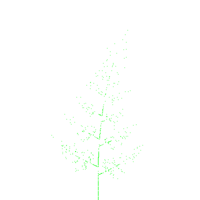

# Aniamted Fern Image Generator


> shidaa sample.png -w 400 -h 400



# Usage

```
USAGE:
    shidaa [OPTIONS] <filepath>

FLAGS:
        --help       Prints help information
    -V, --version    Prints version information

OPTIONS:
    -b, --background <background>    Fern color (CSS Color) [default: rgba (255, 255, 255, 0.0)]
    -c, --color <color>              Fern color (CSS Color) [default: rgba (0, 255, 0, 1.0)]
    -f <frames>                      Number of animation frames [default: 4]
    -h, --height <height>            Image height [default: 1000]
    -i <interval>                    Animation interval (msec) [default: 500]
    -l, --length <length>            Length of fern [default: 10]
    -w, --width <width>              Image width [default: 1000]

ARGS:
    <filepath>    Output file
```
